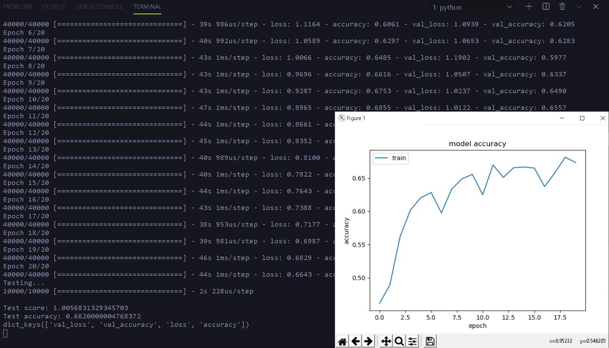

# Reporte Semestral IA

Class: IA
Created: June 9, 2020 1:57 PM
Type: Summary

---

# 1. [Algoritmos de Búsqueda](/search_algorithms)

## 1.0 Caso de estudio - Problema de N-Damas

El proyecto de N-Reinas consiste en una búsqueda a lo ancho en el cual se busca obtener un acomodo de n reinas en un tablero de tal manera que no haya ataques entre ellas.

El objetivo es reorganizar los bloques de un tablero de 3x3 para que los números que se encuentran en éstos, terminen ordenados de manera ascendente. Sólo se permite deslizar los bloques de manera horizontal o verticalmente en el cuadrado en blanco.

## 1.1 Búsqueda a lo Ancho (BFS)

### 1.1.1 Funcionamiento

Es una estrategia de búsqueda en la que se expande primero el nodo raíz, a continuación se expanden todos los sucesores del nodo raíz, después sus sucesores, etc.

En general, se expanden todos los nodos a una profundidad en el árbol de búsqueda antes de expandir cualquier nodo del próximo nivel.

### 1.1.1 Implementación visual en el problema de N-Damas

Empieza a realizar la búsqueda y a mover las reinas en este caso representada por cuadros negros.

Una vez que encuentra el estado en el que se cumple el objetivo de que no haya ataques entre sí detiene la búsqueda y pinta de rojo a las reinas.

## 1.2 Búsqueda de Profundidad (DFS)

### 1.2.1 Funcionamiento

Este tipo de búsqueda siempre expande el nodo más profundo en la frontera actual del árbol de búsqueda.

La búsqueda procede inmediatamente al nivel más profundo del árbol de búsqueda, hasta que los nodos de búsqueda no tienen ningún sucesor.

### 1.2.2 Implementación visual en el problema de N-Damas

## 1.3 Búsqueda de Profundidad Limitada(LDFS)

### 1.3.1 Funcionamiento

Se puede resolver el problema de realizar una búsqueda de profundidad en árboles con hojas ilimitadas definiendo un límite de profundidad L.

Es decir, los nodos a profundidad L se tratan como si no tuvieran ningún sucesor y, por ende, se detiene la expansión de los estados de dicho nodo.

### 1.3.2 Implementación visual en el problema de N-Damas

## 1.4 Búsqueda Iterativa de Profundidad Limitada(IDFS)

### 1.4.1 Funcionamiento

La búsqueda con profundidad iterativa es una estrategia general, usada a menudo en combinación con la técnica LDFS, la cual encuentra el mejor límite de profundidad.

Esto se hace aumentando gradualmente el límite, desde 0 hasta L, deteniéndose únicamente en el caso de que se cumpla la meta o se alcance el último nodo del último nivel.

### 1.4.2 Implementación visual en el problema de N-Damas

## 1.5 Búsqueda Bidireccional

## 1.5.1 Funcionamiento

El algoritmo bidireccional consiste en hacer dos búsquedas a lo ancho, una empezando en el estado inicial indicado y la otra iniciando en el estado meta deseado, y que al encontrarse con un mismo estado en común previamente percibido, imprime el camino desde el nodo de dicho estado en cada búsqueda hasta el nodo raíz de su respectiva búsqueda.

### 1.5.2 Implementación visual en el problema de N-Damas

Se inician las dos búsquedas a lo ancho, evitando los obstáculos (cuadros color negro).

Una vez que encuentra el resultado pinta de color amarillo el camino a seguir.

## [1.6 Algoritmo A\*](/search_algorithms/AStar/test.py)

### 1.6.1 Datos de entrada

- Datos de las entidades
  - Por fines prácticos se extrajeron las coordenadas (en pixeles) de algunas entidades de la República Mexicana en base a una imagen de un mapa satelital.
- Datos de las rutas
  - Se definieron algunas rutas de manera arbitraria.

**cities.csv**

**routes.csv**

**NOTA:** Ambos datos se recobran de archivos separados por coma (**cities.csv, routes.csv**). Éstos pueden ser modificados a gusto del usuario antes de ejecutar el programa. Sin embargo, debe considerarse que ambos archivos deben contener datos únicos y toda entidad que exista en el archivo de rutas, deberá de existir en el archive de ciudades.

### 1.6.2 Algoritmo

Algoritmo principal

Calcula las heurísticas para las ciudades vecinas de la ciudad actual

### 1.6.3 Resultados

Ejecución Baja California - Durango

Resultado

[data/BC-Durango.mp4](data/BC-Durango.mp4)

Recorrido Baja California - Durango

Ejecución Baja California - Nuevo Leon

Resultado

[data/BC-Nuevo-Leon.mp4](data/BC-Nuevo-Leon.mp4)

Recorrido Baja California - Nuevo Leon

NOTA: Para ejecutar el script es necesario instalar GLFW

# 2. [Algoritmos Genéticos](/genetic_algorithms)

## 2.1 [Problema de las N-Damas](/genetic_algorithms/NQueens/)

### 2.1.1 [Algoritmo](/genetic_algorithms/NQueens/01-Nqueens.py)

En la línea 85 se genera el flujo de tal manera que los individuos del salón de la fama (los que tengan el menor número de ataques de la población) son enviados directamente a la siguiente generación sin ser sujetos a ningún tipo de modificaciones genéticas (mutaciones).

Parámetros del modelo genético

### 2.1.2 Resultados

Generaciones y soluciones para N=50, Generaciones = 1000, Población = 3000.

# 3. Redes Neuronales

## 3.0 [Red Neuronal básica](/neural_networks/simple-neural-network/NeuralNetwork.py)

## 3.1 (Clasificación del dataset Iris usando la Red Neuronal básica) [/neural_networks/simple-neural-network/Iris_Perceptron.ipynb]

[Iris Dataset](https://www.kaggle.com/uciml/iris).

### 3.1.1 Entrenamiento

### 3.1.2 Pruebas

## 3.2 [Clasificación del dataset Iris usando Tensorflow](neural_networks/simple-neural-network/Iris_Tensorflow.ipynb)

### 3.2.1 Entrenamiento

### 3.2.2 Pruebas

# 4. [Redes Neuronales Convolucionales usando Keras](neural_networks/CNN/CNN_model_generation.ipynb)

## 4.0 Descripción

En la libreta jupyter **CNN_model_generation** define y entrena el modelo de la CNN. Se tomaron como entrada imágenes de 32px x 32px del famoso dataset [CIFAR10](https://www.kaggle.com/c/cifar-10), pero únicamente de las clases Perro,Gato,Rana para reducir el tiempo de entrenamiento.

Los resultados del entrenamiento del modelo fueron los siguientes:

## 4.1 Capas del Modelo

## 4.2 Entrenamiento del modelo

## 4.3 [Pruebas](neural_networks/CNN/model_testing.ipynb)

### 4.3.1 Pruebas con muestra de entrenamiento

Se guarda el modelo de la red neuronal entrenada en un archivo .h5

### 4.3.2 Pruebas con imágenes recobradas de internet

Se recabaron 7 muestras diferentes de internet por cada clasificación (Gato, Rana, Perro) y se redimensionaron para coincidir con las imágenes de entrenamiento de 32px X 32px

Algoritmo de pruebas para imágenes descargadas de la web.

Resultados
